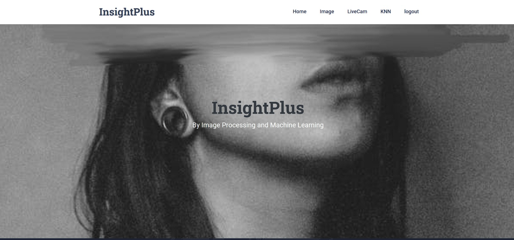

# InsightPlus - "Stress-Detection-using-ML-and-Image-Processing-Techniques" 

## Upgraded System Features:
* to detect stress using vivid Machine learning and Image processing techniques
* Incorporates live detection and personal counseling.
* Performs periodic analysis of employees' stress levels.
* Provides proper remedies for managing stress.
* Focuses on creating a healthy and spontaneous working environment.

## Machine Learning Integration:
* Utilizes Machine Learning algorithms like KNN classifiers for stress classification.
## Image Processing Component:
* Applied at the initial stage for stress detection.
* Takes employee images as input.
* Converts images into digital form.
* Performs operations for enhancing images and extracting useful information.
* Output and Emotion Display:

## Displays emotions indicating stress levels (e.g., Angry, Disgusted, Fearful, Sad) in rounded boxes.

### Survey Form Integration: 
Provides employees with periodic survey forms for stress assessment and management.
### Objective:
Aims to manage stress effectively and optimize people's performance during working hours.

